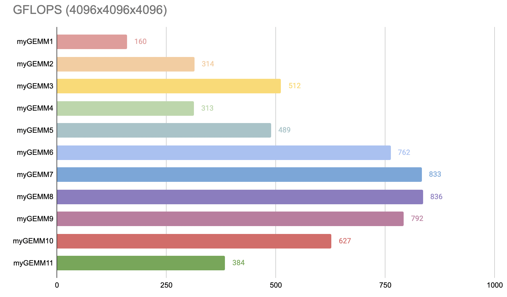
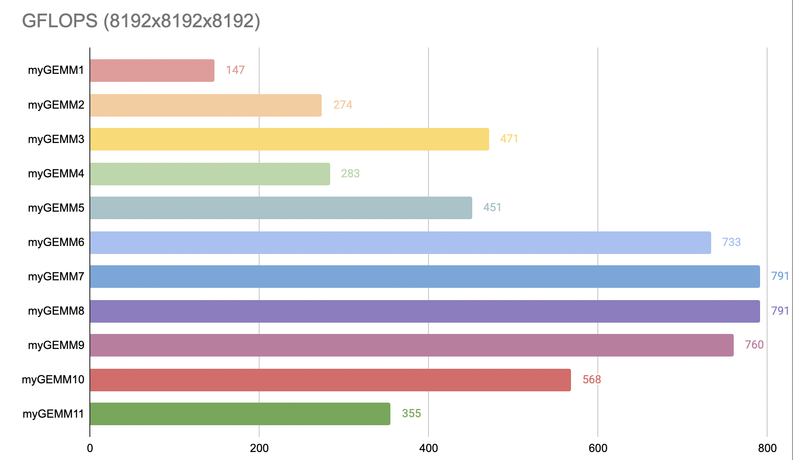

Exploring the performance of SGEMM in OpenCL on NVIDIA GPUs
=============

Date: 31-Oct-2014 - 07-Nov-2014

Author: Cedric Nugteren, SURFsara (http://www.surfsara.nl)

This repository contains multiple OpenCL implementations of single-precision generalised matrix-multiplication (SGEMM) tuned for an NVIDIA Tesla K40m GPU. The different versions (named myGEMM) are part of a step-by-step tutorial, in which each step adds a new optimisation. The different steps and the details of the OpenCL kernel codes are all explained in depth at https://cnugteren.github.io/tutorial/pages/page1.html.

The OpenCL kernels can be used natively using the OpenCL framework. However, there is also a header-file included which converts the OpenCL kernels into CUDA syntax. This allows the same code to be tested through the CUDA-toolchain.

Apart from the OpenCL kernel codes, this repository contains fully working host code, including a loop over different matrix sizes and different BLAS libraries. It contains code to run NVIDIA's cuBLAS as a reference and the open-source clBlas library.

Pre-requisites:
* A C++ compiler (tested with GCC and ICC)
* The CUDA toolkit and NVCC compiler (tested with version 6.5)
* OpenCL headers and libraries (part of the CUDA toolkit)

Requirements to run the performance and correctness comparisons:
* The cuBLAS library (part of the CUDA toolkit, tested version 6.5)
* The open-source clBlas library (tested 2.2.0)

Usage
=============

*	Compile the code:

		make build

	Compiles the benchmarking infrastructure and the myGEMM kernels. Make sure there is a "bin" and "obj" directory available. Note that you might have to edit the Makefile to set the proper locations of the CUDA and OpenCL installations on your system.

*	Run the code:

		make run

	This runs the code for matrices ranging from MINSIZE to MAXSIZE (defined in src/common.h). It will run cuBLAS, clBlas, and the CUDA and OpenCL versions of the myGEMM kernels. The particular kernel to be executed is defined using the KERNEL keyword in src/settings.h. This file also contains other settings you might want to modify for your particular GPU.

*	Inspect the code:

		make inspect

	This generates all kinds of assembly-like versions of the CUDA kernels in the "bin" subdirectory. It also prints out statistics of the kernels such as the register usage.

Minimal working example
=============

Additionally, we supply the minimal.cpp file in the 'extra' directory. This file is a self-contained minimal working example (MWE) of the most basic SGEMM kernel (myGEMM1). This can be useful if you don't want to deal with Makefiles or don't have the CUDA, cuBLAS, or clBlas installed. Note that minimal.cpp misses some features compared to the main code, but we believe that it can nevertheless be a good starting point if you want to integrate myGEMM into your own code.

The code can be compiled using a regular C++ compiler and only requires OpenCL installed. Example compilation from the root folder:

	g++ -O3 -Wall -I/path/to/opencl/include extra/minimal.cpp -o bin/minimal -lOpenCL

Be aware that the minimal working example does not:
*	Iterate over multiple matrix sizes
*	Compare performance with cuBLAS or clBlas
*	Check for correctness of the results
*	Check for OpenCL errors
*	Load a kernel-file from disk, instead it is embedded as a string

###################################################

# Apple M3 SGEMM Optimization Experiments

This repository contains performance evaluation and step-by-step optimization analysis for single-precision matrix multiplication (SGEMM) kernels using OpenCL on Apple Silicon.

The project is adapted from the SGEMM tuning tutorial by Cedric Nugteren: https://cnugteren.github.io/tutorial/pages/page1.html

The main goal is to analyze how progressive optimization techniques impact throughput on a Unified Memory GPU architecture.

---

## Experimental Setup

### Hardware

- **Chip:** Apple M3 (8-core CPU / 10-core GPU)
- **Memory:** 8 GB Unified Memory Architecture (UMA)

### Software & Environment

- **OS:** macOS Tahoe 26.1
- **Framework:** Apple OpenCL 1.2 (Embedded Profile)
- **Compiler:** Apple Clang (Xcode Command Line Tools)
- **Flags:** `-O3 -Wall -framework OpenCL`
- **Build Note:** A host-side Python script (`calculate_kernels.py`) is utilized to dynamically generate kernel-specific configuration macros and write them to `src/settings.h`. This prevents execution and compile-time crashes in the Apple `cl2Metal` translation layer when processing complex macro math directly inside kernel files.

---

## Benchmark Configuration and Measurement Methodology

To ensure statistical stability and reliable GFLOPS metrics, the following workflow was deployed:

- **Matrix sizes tested:** `4096x4096x4096`, `8192x8192x8192`
- **Kernel executions:** Each kernel was executed **50 times per matrix size** for stable statistics
- **Warm-up runs:** 15 warm-up runs were performed before measurements to stabilize GPU performance
- **Performance metric:** GFLOPS (Giga Floating Point Operations per Second)
**Statistical Analytics Captured:**
- **Mean Performance:** Average throughput in GFLOPS.
- **Standard Deviation (std):** Measures performance stability across runs.
- **95% Confidence Interval (CI):** Calculated via Student's t-distribution to show the true mean bounds.
- **Normality Assessment:** p-values from D'Agostino-Pearson and Shapiro-Wilk tests to check the distribution of results.

## SGEMM Optimization Steps

The tutorial progressively optimizes the SGEMM kernel. Each kernel corresponds to a specific optimization step:

| Kernel | Optimization                                   |
|--------|------------------------------------------------|
| 1      | Baseline naive implementation (no caching)     |
| 2      | Tiling using GPU Local Memory                  |
| 3      | Thread-level work accumulation (more WPT)      |
| 4      | Vectorized types (float4)                      |
| 5      | Transposed matrix and rectangular tiles        |
| 6      | 2D register blocking                           |
| 7      | 2D register blocking + vectorized loads        |
| 8      | Layout adjustments for compute units           |
| 9      | Pre-fetching data into registers               |
| 10     | Padding for arbitrary (non-power-of-two) sizes |
| 11     | Complete padding implementation                |

---

### Kernel Configuration Parameters

The parameters used for each kernel (as defined in KERNEL_CONFIGS within the Python script):

| Kernel | Tuned parameters                                           |
|--------|------------------------------------------------------------|
| 1      | TS = 16                                                    |
| 2      | TS = 16                                                    |
| 3      | TS = 32, WPT = 4                                           |
| 4      | TS = 16, WIDTH = 2                                         |
| 5      | TS = 32, WPT = 4, TSDK = 32, WIDTH = 4                     |
| 6      | TSM = 64, TSN = 64, TSK = 8, WPTM = 8, WPTN = 4, WIDTH = 4 |
| 7      | TSM = 64, TSN = 64, TSK = 8, WPTM = 8, WPTN = 4, WIDTH = 2 |
| 8      | TSM = 64, TSN = 64, TSK = 8, WPTM = 8, WPTN = 4, WIDTH = 4 |
| 9      | TSM = 64, TSN = 64, TSK = 8, WPTM = 8, WPTN = 4, WIDTH = 4 |
| 10     | TSM = 32, TSN = 32, TSK = 8, WPTM = 8, WPTN = 4, WIDTH = 2 |
| 11     | RX = 4, RY = 4, RTSM = 4, RTSN = 4                         |

---

## Performance Tables

### Matrix Size: 4096x4096x4096

| Implementation | Mean GFLOPS | Mean (95% CI) | Std (95% CI) | D'agostino p | Shapiro p  |
|----------------|-------------|---------------|--------------|--------------|------------|
| myGEMM1 (cl)   | 160         | 159-161       | 4 (3-5)      | 0.0008       | 0.0042     |
| myGEMM2 (cl)   | 314         | 312-316       | 7 (5-8)      | 0.0002       | 0.0001     |
| myGEMM3 (cl)   | 512         | 508-515       | 12 (10-15)   | 0.1856       | 0.1167     |
| myGEMM4 (cl)   | 313         | 311-315       | 6 (5-7)      | 0.0015       | 0.0000     |
| myGEMM5 (cl)   | 489         | 486-493       | 12 (10-16)   | 0.0708       | 0.3378     |
| myGEMM6 (cl)   | 762         | 757-767       | 17 (14-22)   | 0.9637       | 0.9551     |
| myGEMM7 (cl)   | 833         | 827-840       | 23 (19-29)   | 0.0463       | 0.1740     |
| myGEMM8 (cl)   | 836         | 831-842       | 21 (17-26)   | 0.4103       | 0.3917     |
| myGEMM9 (cl)   | 792         | 786-798       | 21 (18-26)   | 0.0101       | 0.0336     |
| myGEMM10 (cl)  | 627         | 622-632       | 17 (14-21)   | 0.8746       | 0.9544     |
| myGEMM11 (cl)  | 384         | 381-387       | 10 (8-12)    | 0.1113       | 0.0078     |

---

### Matrix Size: 8192x8192x8192

| Implementation | Mean GFLOPS | Mean (95% CI) | Std (95% CI) | D'agostino p | Shapiro p |
|----------------|-------------|---------------|--------------|--------------|-----------|
| myGEMM1 (cl)   | 147         | 146-148       | 3 (3-4)      | 0.0000       | 0.0022    |
| myGEMM2 (cl)   | 274         | 273-274       | 1 (1-2)      | 0.1210       | 0.0700    |
| myGEMM3 (cl)   | 471         | 470-472       | 3 (2-3)      | 0.6314       | 0.7466    |
| myGEMM4 (cl)   | 283         | 282-283       | 1 (1-2)      | 0.0021       | 0.0003    |
| myGEMM5 (cl)   | 451         | 451-452       | 2 (2-3)      | 0.8925       | 0.9361    |
| myGEMM6 (cl)   | 733         | 732-734       | 4 (3-5)      | 0.6388       | 0.2628    |
| myGEMM7 (cl)   | 791         | 790-793       | 5 (4-7)      | 0.0965       | 0.3370    |
| myGEMM8 (cl)   | 791         | 789-793       | 6 (5-8)      | 0.0037       | 0.0000    |
| myGEMM9 (cl)   | 760         | 758-761       | 6 (5-7)      | 0.2115       | 0.2255    |
| myGEMM10 (cl)  | 568         | 567-570       | 5 (4-6)      | 0.0000       | 0.0000    |
| myGEMM11 (cl)  | 355         | 353-358       | 8 (6-9)      | 0.0006       | 0.0219    |

---

## Charts

Performance charts are saved in the charts/ folder:

---

## Notes & Performance Analysis
- **Testing Conditions:** All experiments were conducted with background user applications completely closed while the system was kept in an idle state to minimize external interference on hardware resource availability.
- **Platform-Specific Architecture (cl2Metal):** Since Apple has deprecated OpenCL support in favor of the Metal API, kernel execution relies on the `cl2Metal` translation layer. This compiler pipeline is highly sensitive to complex macro expansions directly within the kernel files (`.cl`). To prevent GPU compilation faults, the orchestration of tuning macros was successfully offloaded to a host-side Python script.
- **Analysis of Normality Deviations (p < 0.05):** Some implementations did not pass the normality tests (p < 0.05). To investigate this, we monitored GPU clock frequency, temperature, power, and memory metrics, but none of these variables correlated with the observed statistical anomalies. The results remain consistent and distinct across different kernels, confirming that these minor outliers do not impact the overall performance evaluation.
- **Artifact Preservation:** All generated performance plots are automatically exported as PNG files and are available within the `charts/` directory.
